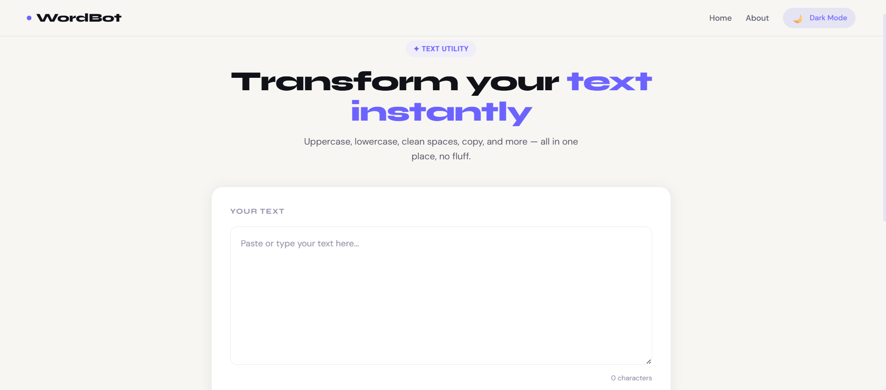

# WordBot ✦

> A fast, minimal text utility web app — transform, analyze, and clean your text instantly.

**🌐 Live Demo → [wordbot.netlify.app](https://wordbot.netlify.app)**

---

## Preview



---

## Features

- **Case Conversion** — Uppercase, lowercase, and title case in one click
- **Word Reversal** — Reverse the order of words in your text
- **Space Cleaner** — Remove extra whitespace and normalize spacing
- **One-Click Copy** — Copy the entire transformed text to clipboard
- **Live Text Stats** — Word count, character count, sentence count, and reading time
- **Live Preview** — See your text as you type before applying transforms
- **Dark / Light Mode** — Smooth theme toggle with system-level CSS variables
- **Toast Notifications** — Instant feedback for every action (no alert boxes)
- **Fully Responsive** — Works on mobile, tablet, and desktop

---

## Tech Stack

| Layer | Technology |
|---|---|
| Framework | React 19 |
| Routing | React Router DOM v6 |
| Styling | Custom CSS (CSS Variables, no UI framework) |
| Fonts | Syne + DM Sans (Google Fonts) |
| Build Tool | Create React App (react-scripts) |
| Deployment | Netlify |
| Version Control | Git + GitHub |

---

## Getting Started

### Prerequisites

- Node.js 18.x or higher
- npm

### Installation

```bash
# Clone the repository
git clone https://github.com/your-username/wordbot.git
cd wordbot

# Install dependencies
npm install

# Start development server
npm start
```

The app will open at `http://localhost:3000`.

### Build for Production

```bash
npm run build
```

The optimized build will be in the `/build` folder, ready to deploy.

---

## Project Structure

```
wordbot/
├── public/
│   ├── index.html          # HTML entry point with Google Fonts
│   └── manifest.json
├── src/
│   ├── Components/
│   │   ├── Navbar.js       # Sticky navbar with dark mode toggle & mobile menu
│   │   └── TextForm.js     # Core text utility — actions, stats, preview
│   ├── App.js              # Root component, theme state management
│   ├── App.css
│   └── index.css           # Full design system (tokens, layout, components)
├── netlify.toml            # Netlify build config + SPA redirect rule
└── package.json
```

---

## Deployment (Netlify)

This project includes a `netlify.toml` for zero-config deployment.

### Deploy from GitHub

1. Push your code to a GitHub repository
2. Go to [netlify.com](https://netlify.com) → **Add new site** → **Import an existing project**
3. Connect GitHub and select your repo
4. Netlify auto-detects settings from `netlify.toml`:
   - **Build command:** `npm run build`
   - **Publish directory:** `build`
5. Click **Deploy** — live in ~60 seconds

### Manual Deploy via Netlify CLI

```bash
npm install -g netlify-cli
netlify login
netlify deploy --prod
```

---

## Design System

The entire UI is driven by CSS custom properties, making theming trivial:

```css
:root {
  --accent: #6C63FF;
  --font-display: 'Syne', sans-serif;
  --font-body: 'DM Sans', sans-serif;
  --bg: #F7F6F2;
  --bg-card: #FFFFFF;
}

[data-theme="dark"] {
  --bg: #0D0D14;
  --bg-card: #17172A;
  --accent: #8B82FF;
}
```

Switching themes is a single attribute toggle on `<html>` — no class juggling, no JS-heavy theming libraries.

---

## Contributing

Pull requests are welcome! For major changes, please open an issue first.

1. Fork the repo
2. Create your feature branch: `git checkout -b feature/my-feature`
3. Commit your changes: `git commit -m 'Add my feature'`
4. Push to the branch: `git push origin feature/my-feature`
5. Open a pull request

---

## License

[MIT](LICENSE)

---

<p align="center">Built with React · Hosted on Netlify</p>
